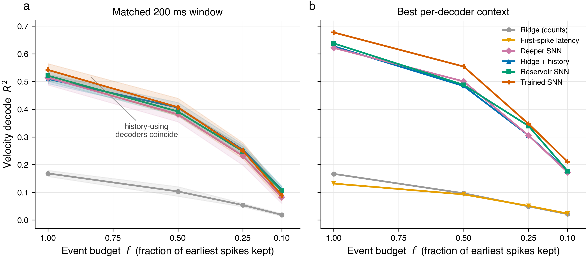
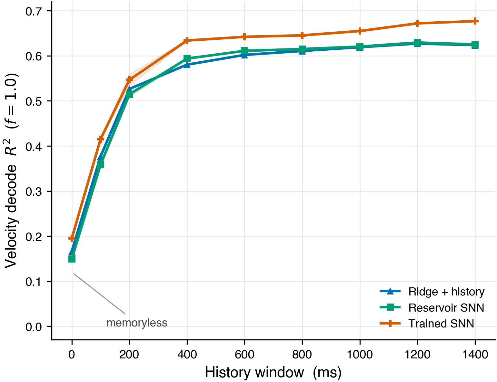
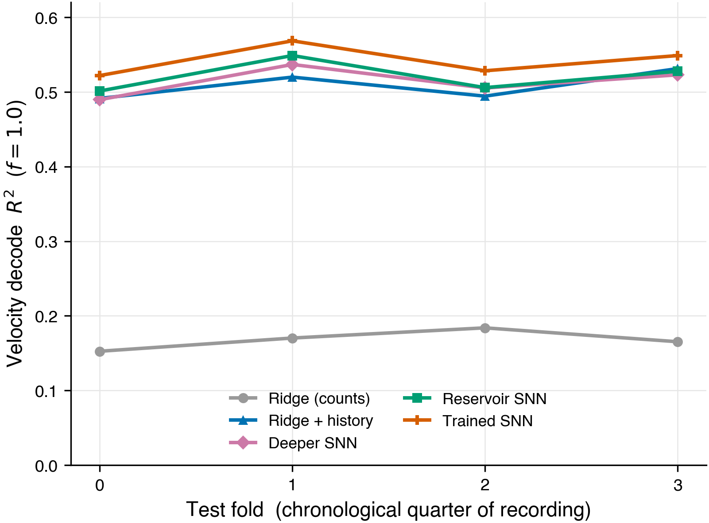
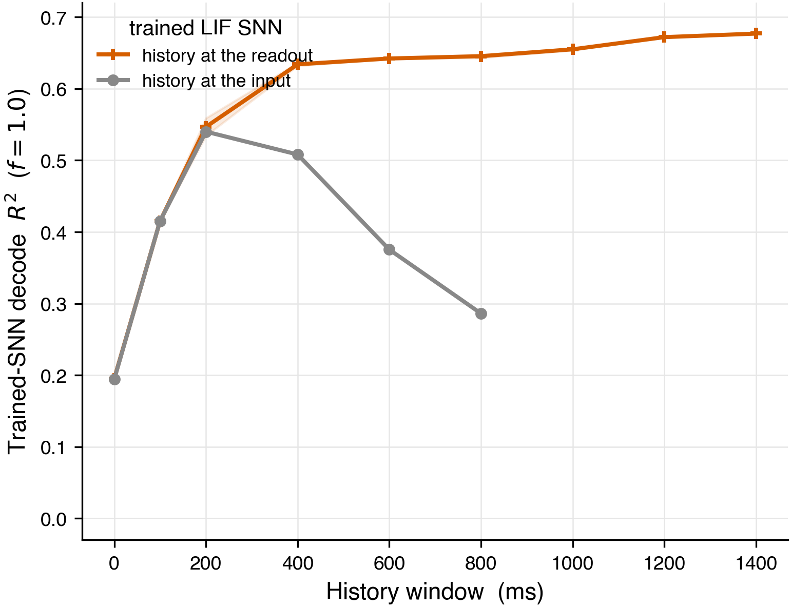
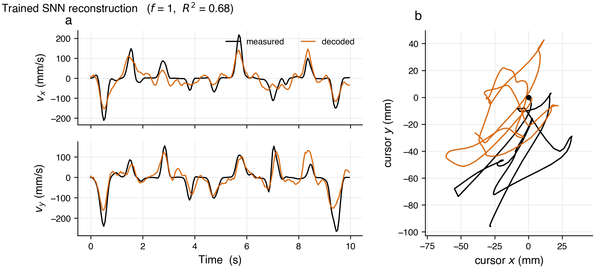
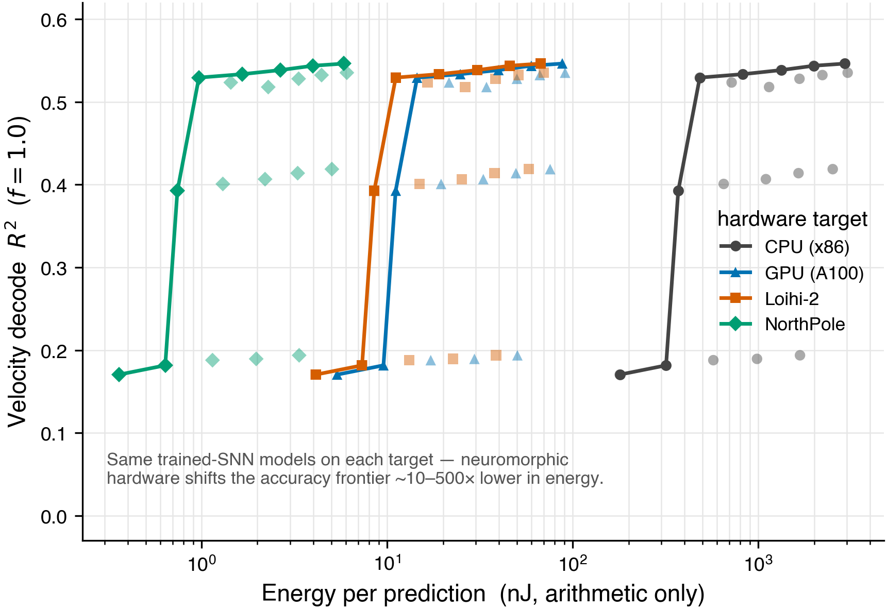

# Sparse Event-Based Neuromorphic Decoding for Implantable Brain–Computer Interfaces

[](LICENSE)
[](pyproject.toml)
[](docs/dataset.md)

A controlled study of how much of a motor-cortex velocity decode survives
when the spike stream is made progressively sparser, and whether an
event-driven spiking neural network (SNN) can match a strong linear
decoder while exposing a path to low-energy implantable hardware.

**Authors:** Manraj Mondair, Alexander Soto · **Course:** EE207 — *Neuromorphics: Brains in Silicon*

---

## Abstract

We decode continuous 2D cursor velocity from primary motor-cortex spiking
activity (Neural Latents Benchmark **MC_RTT**) and ask how the decode degrades
as we retain only the earliest fraction *f* of spike events in each time bin,
and how event-driven spiking decoders compare to strong linear baselines.
Across a multi-seed, blocked cross-validation grid we find that **temporal
context, not fine within-bin spike timing, carries the signal**: a memoryless
decoder reaches only R² ≈ 0.17, while ≈ 200 ms of history triples it to
R² ≈ 0.5–0.54 — and at that matched window the linear, reservoir-SNN, and
trained-SNN decoders are statistically indistinguishable. A battery of null
controls shows the decode is driven by per-bin firing rate and its temporal
alignment to movement, not within-bin spike order, precise timing, or neuron
identity. Given each decoder its own deeper context window, the spiking
decoders pull ahead: a trained LIF SNN whose readout sees a lag-stacked window
of its hidden activity reaches **R² = 0.68 at *f* = 1.0 — the most accurate
decoder at every budget** — with a fixed random-projection reservoir SNN
(R² = 0.64) just behind. The SNNs therefore lead on **both accuracy and
energy**: their sparse, event-driven synaptic operations map to tens of
nanojoules per prediction on Loihi-2-class neuromorphic hardware, orders of
magnitude below a dense GPU/CPU readout.

<p align="center">
  <br>
  <em><b>Decoder accuracy vs. sparse event budget.</b> (a) At a matched ≈ 200 ms
  history window (blocked CV, mean ± std across folds and seeds) every
  history-using decoder coincides — temporal context, not decoder class, sets the
  accuracy. (b) Given each decoder its own validation-selected context window, the
  spiking decoders pull ahead, the trained LIF SNN leading at every budget. Both
  far exceed the memoryless count decoder.</em>
</p>

## Key findings

1. **Temporal context dominates.** A memoryless count decoder reaches
   R² ≈ 0.17 at full budget; stacking ≈ 4 bins (200 ms) of history triples
   it to R² ≈ 0.5–0.54 for both the linear and spiking decoders.
2. **At equal context the decoders tie; with its own deep context the SNN
   leads.** At a matched 200 ms window the trained SNN, reservoir SNN, and
   ridge + history are statistically indistinguishable (R² ≈ 0.51–0.54,
   overlapping CIs). Given a deeper lag-stacked readout the trained LIF SNN
   reaches R² = 0.68 at *f* = 1.0 — the best decoder at every budget — with the
   fixed-encoder reservoir SNN (0.64) just behind.
3. **Rate and alignment carry the decode — not within-bin latency order.**
   Only destroying the bin-to-velocity alignment (circular shift) collapses
   R²; shuffling within-bin order, randomizing precise times, or permuting
   neuron identity leaves it essentially unchanged.
4. **Sparsifying the spike stream costs accuracy monotonically.** Accuracy
   falls smoothly as events are dropped; for a *memoryless* decoder it reaches
   chance below ≈ 25 % of events (permutation test n.s. at *f* = 0.10). Deep
   temporal context buys margin even there — the best decoders still hold
   R² ≈ 0.18–0.21 at *f* = 0.10.
5. **The neuromorphic payoff is energy.** An event-driven readout avoids the
   bulk of dense multiply-accumulates; at the headline configuration the
   SNN uses ≈ 2,000 synaptic operations per prediction (~46 nJ/prediction on
   Loihi 2 at 23 pJ/synop), against far higher dense GPU/CPU cost.

For context, our matched-window R² ≈ 0.51–0.54 sits with the strong linear /
GPFA / SLDS baselines on the NLB MC_RTT leaderboard (0.49–0.58), while our best
deep-context decoder (trained SNN, R² = 0.68 at *f* = 1.0) reaches the
latent-dynamics tier that tops the benchmark (Transformer NDT 0.62, AutoLFADS
0.67, MINT 0.69) — see [`results/benchmark/nlb_mc_rtt_published.json`](results/benchmark/nlb_mc_rtt_published.json).

<p align="center">
  <br>
  <em><b>Temporal context is the dominant lever.</b> At full budget, every
  history-capable decoder climbs from near-chance (memoryless) to R² ≈ 0.6–0.68
  as the readout sees more of the recent past, converging by ≈ 400 ms. The
  decoder family barely matters once context is matched.</em>
</p>

## Background and research question

Implantable BCIs are power- and bandwidth-limited: every spike transmitted
and every multiply-accumulate performed costs energy on a device that must
dissipate almost none. This motivates *event-driven* decoders that process
only a fraction of the spike stream. The study isolates two factors that are
usually entangled — **how much spike information is kept** (the event budget
*f*) and **how the decoder uses temporal structure** — and measures their
separate effect on a standard continuous-velocity decode, alongside the
energy each design would consume on neuromorphic hardware.

## Dataset

Neural Latents Benchmark **MC_RTT** (primary motor cortex, self-paced random
target reaching; DANDI dandiset `000129`). Provenance, citation, and the
two-line download are documented in [`docs/dataset.md`](docs/dataset.md);
the processed-data contract every model depends on is in
[`docs/data_interface.md`](docs/data_interface.md). Raw and processed data
are never committed — each user downloads their own copy.

## Methods

**Preprocessing.** Spikes are binned at 50 ms into both a dense
`[bins × neurons]` count matrix and per-bin sparse `(time, neuron)` event
lists. The target is 2D cursor velocity from a smoothed central finite
difference. Splits are time-contiguous (70/15/15) with boundary gaps so
finite-difference and lag features cannot leak labels across splits.

**Event budget.** For fraction *f*, each bin keeps its earliest
`max(1, ⌊f·n⌋)` spikes; the dense counts are rebuilt from the survivors so
every decoder sees a consistent, sparsified stream.

**Decoders.**

| Decoder | Description |
|---|---|
| **Ridge (counts)** | L2-regularized linear map from per-bin spike counts; α selected on validation. |
| **Ridge + history** | Same, with the previous *k* bins stacked as features (boundary-safe); *k* selected on validation. |
| **Latency** | First-spike-time per neuron + ridge readout; isolates the within-bin latency signal (control). |
| **Trained SNN** | LIF hidden layer over 10 × 5 ms sub-bins, surrogate-gradient BPTT, linear velocity readout (CUDA). History reaches the readout by lag-stacking the trained per-bin hidden features (`readout_lag`); piling history onto the *input* instead saturates the single LIF state past ≈ 8 bins, so the readout route is what lets it use deep context. Depth selected on validation. |
| **Reservoir SNN** | Fixed (untrained) random-projection LIF encoder replayed in spike-time order; ridge readout over the current bin's hidden activity stacked with a boundary-safe multi-bin history window (optional leaky echo-state reservoir). α and history depth selected on validation. |
| **Deeper SNN** | Multi-layer (optionally recurrent) LIF + lag-stacked readout — a capacity probe. Neither depth nor recurrence beats the single-layer trained SNN, so capacity is not the bottleneck. |

**Controls.** Order-shuffle, phase-randomize, neuron-identity-shuffle, and
circular-shift nulls, plus a permutation test (*n* = 1,000) at each budget.
These within-bin / alignment controls are run on the **per-bin reservoir
encoder** (memoryless readout) to isolate within-bin structure; the
deep-context decoders in the results tables layer cross-bin history on top.

**Efficiency model.** Dense MACs (`2·N·T`) versus event-driven synaptic
operations (`2·E + 2·T`), converted to energy with published per-operation
figures: CPU ≈ 1 nJ, A100 ≈ 30 pJ, Loihi 2 ≈ 23 pJ, NorthPole ≈ 2 pJ
(arithmetic energy only — no memory, leakage, or radio).

**Evaluation.** Joint velocity R² (with per-axis decomposition) and
bootstrap 95 % CIs, reported across a multi-seed blocked cross-validation
grid.

## Results

Blocked CV (4-fold leave-one-block-out, multi-seed), mean ± std across folds
and seeds, with every decoder held to a **matched ≈ 200 ms history window** for
an apples-to-apples head-to-head (full battery — sensitivity, Pareto, bin-size,
channel-dropout — in [`results/cluster/summary.md`](results/cluster/summary.md)):

| Decoder | *f* = 1.00 | *f* = 0.50 | *f* = 0.25 | *f* = 0.10 |
|---|---|---|---|---|
| Ridge (counts) | 0.168 ± 0.013 | 0.103 ± 0.020 | 0.054 ± 0.007 | 0.019 ± 0.005 |
| Ridge + 4-bin history | 0.509 ± 0.020 | 0.406 ± 0.021 | 0.253 ± 0.023 | 0.110 ± 0.013 |
| Trained SNN (BPTT) | 0.542 ± 0.021 | 0.407 ± 0.036 | 0.250 ± 0.034 | 0.089 ± 0.022 |
| Reservoir SNN | 0.521 ± 0.022 | 0.392 ± 0.016 | 0.248 ± 0.020 | 0.105 ± 0.016 |
| Deeper SNN (2-layer) | 0.514 ± 0.021 | 0.381 ± 0.031 | 0.231 ± 0.036 | 0.082 ± 0.025 |

At a matched 200 ms window the history-using decoders sit together
(R² ≈ 0.51–0.54 at *f* = 1.0) — depth and the SNN encoders neither help nor
hurt here. The gaps open up only when each decoder is given its own
best (deeper) context window; see [Best configuration](#best-configuration-of-every-decoder)
below, where the spiking decoders pull ahead.

Permutation test: decode is significant at *f* ≥ 0.25 (*p* ≈ 0.001 at *f* =
1.0 and 0.5, *p* ≈ 0.04 at 0.25) and not significant at *f* = 0.10.

<p align="center">
  <br>
  <em><b>Stable across the recording.</b> Per-fold R² (leave-one-block-out CV, full
  budget) holds across all four chronological quarters — the decode is not an
  artifact of one split, and the decoder ordering is consistent throughout.</em>
</p>

### Best configuration of every decoder

The table above matches all decoders at a 4-bin (≈ 200 ms) history window for a
fair head-to-head. Selecting each decoder's history depth on validation instead
— giving every history-capable model up to ≈ 1.4 s of context — shows that
temporal context is the dominant lever, and that the spiking decoders lead once
they can use it:

| Decoder (best config) | *f* = 1.00 | *f* = 0.50 | *f* = 0.25 | *f* = 0.10 |
|---|---|---|---|---|
| Ridge (single-bin counts) | 0.166 | 0.096 | 0.049 | 0.021 |
| First-spike latency | 0.131 | 0.092 | 0.051 | 0.023 |
| Deeper SNN (2-layer LIF) | 0.621 | 0.500 | 0.305 | 0.173 |
| Ridge + deep history (*k* = 24) | 0.627 | 0.484 | 0.305 | 0.176 |
| **Reservoir SNN** (fixed random LIF + lag-stacked ridge) | 0.638 | 0.488 | 0.339 | 0.177 |
| **Trained SNN** (LIF + lag-stacked readout) | **0.677** | **0.554** | **0.347** | **0.210** |

Mean test R² over 3 seeds; history depth selected on validation (per budget for
the SNNs). Two takeaways: (1) the memoryless baselines (counts, latency) sit at
their ceilings, but every decoder given ≈ 1 s of context reaches R² ≈ 0.6 at
full budget — temporal context, not decoder class, carries the decode; (2) the
neuromorphic SNNs are the **best** decoders, not only the most efficient — a
trained LIF SNN whose readout sees a lag-stacked window of its per-bin hidden
activity tops every event budget, with the fixed-encoder reservoir SNN just
behind. A 2-layer / recurrent LIF (the *deeper SNN* capacity probe) does **not**
improve on this — its best stack reaches only 0.621 and recurrence is worse —
confirming the bottleneck is temporal context, not model capacity. Full
per-model results + figure in [`results/best/`](results/best/).

<p align="center">
  <br>
  <em><b>Why the trained SNN must see history at the readout.</b> Piling history
  onto the LIF <em>input</em> blurs it through a single leaky state and saturates
  past ≈ 8 bins; lag-stacking the trained per-bin features at the <em>readout</em>
  instead keeps the encoder on short, trainable sequences and scales to R² = 0.68.</em>
</p>

<p align="center">
  <br>
  <em><b>Best-decoder reconstruction (trained SNN, full budget).</b> (a) Decoded
  vs. measured cursor velocity over a held-out segment; (b) the integrated 2-D
  cursor path. Velocity is tracked tightly (R² = 0.68); position drifts slowly
  as small velocity errors accumulate, as expected of a velocity decoder.</em>
</p>

<p align="center">
  <br>
  <em><b>The neuromorphic payoff.</b> The same trained-SNN models, costed on four
  hardware targets: event-driven neuromorphic chips (Loihi-2, NorthPole) reach the
  same accuracy at ~10–500× lower arithmetic energy per prediction than a dense
  CPU readout.</em>
</p>

## Repository layout

```
src/data/         NLB MC_RTT loading, binning, velocity, train/val/test split
src/features/     spike-count, lag-history, latency, event-budget, jitter, causal-window
src/models/       ridge, latency, trained LIF SNN (BPTT), reservoir SNN, deeper SNN, readouts
src/controls/     order-shuffle and the multi-null battery
src/evaluation/   R² metric, efficiency/energy model, experiment runner, plots
src/utils/        seeding and a mock-data generator (schema-identical to real)
scripts/          one CLI per experiment (run with --help)
notebooks/        Colab GPU walkthrough of the ridge baseline
docs/             dataset provenance and the shared data-interface contract
cluster/          SLURM job scripts + operator docs for the H100 grids
results/          per-experiment CSV/JSON, prediction npz, and final figures
tests/            invariant and smoke tests (run on mock data, no download needed)
report/           bibliography for the write-up
```

## Reproducing the results

```bash
python -m venv .venv && source .venv/bin/activate
pip install -r requirements.txt
pip install --no-deps nlb-tools            # upstream pandas pin clash — see docs/dataset.md

python scripts/download_mc_rtt.py          # -> data/raw/000129/*.nwb
python scripts/preprocess_mc_rtt.py        # -> data/processed/processed_mc_rtt.npz

python scripts/run_ridge.py                                  # count baseline
python scripts/run_ridge.py --lag-bins 24 \
    --results-json results/ridge/ridge_lag24_results.json    # deep-history linear baseline
python scripts/run_snn.py                                    # reservoir SNN (per-budget lag) + shuffle control
python scripts/run_trained_snn_grid.py                       # trained SNN readout-lag sweep (best decoder)
python scripts/run_history_sweeps.py                         # R² vs history-depth sweeps (fig 2/3 data)
python scripts/aggregate_best_models.py                      # best-of-every-model table + figure
python scripts/run_efficiency_analysis.py                    # MAC / energy accounting
python scripts/generate_paper_figures.py                     # publication figure set (results/figures/fig1–6)
python scripts/analyze_trained_snn_weights.py                # supplementary: learned weights + tuning
python scripts/plot_hidden_dim_scaling.py                    # supplementary: capacity scaling
python scripts/run_failure_analysis.py                       # supplementary: failure modes vs speed
python scripts/run_online_streaming.py                       # supplementary: online latency + drift
```

All figures use one shared style (`src/evaluation/figstyle.py`) and are written
to `results/figures/` as both 300-dpi PNG and vector PDF — `fig1`–`fig6` are the
paper figures, `supp_*` the supplementary panels.

Every experiment knob lives in the per-script `argparse` interface
(`--help`). The multi-seed grids, permutation test, and energy Pareto were
produced on a 32× H100 SLURM cluster; the job scripts and operator playbook
are in [`cluster/`](cluster/), and those outputs live under
`results/cluster/`.

The SNN side can be developed without the real download via
`src.utils.mock_data.make_mock_processed_data()`, which returns an object
with the same schema as the preprocessor.

## Tests

```bash
pytest tests/
```

Smoke and invariant checks run against mock data (no NLB download required):
the shared data-interface invariants, event-budget filter properties, the
joint R² metric against analytical cases, the dense/event-driven MAC
accounting, and the SNN encode → readout pipeline including the controls.

## Citation

If you use this code, please cite the repository (see
[`CITATION.cff`](CITATION.cff)) and the dataset:

```bibtex
@inproceedings{nlb2021,
  author    = {Pei, Felix and others},
  title     = {Neural Latents Benchmark: Evaluating Latent Variable Models of Neural Population Activity},
  booktitle = {Advances in Neural Information Processing Systems},
  year      = {2021}
}
```

Related work on spiking decoders for implantable BMI is collected in
[`report/refs.bib`](report/refs.bib).

## License

Released under the [MIT License](LICENSE). The MC_RTT dataset retains its
own DANDI license and is not redistributed here.
